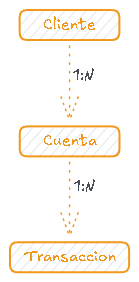

# Sistema de Gestión Bancaria

Implementar y simular un sistema bancario en memoria que permita administrar clientes, cuentas, transacciones y reportes financieros.

## Modelo ER

las relaciones entre las entidades son las siguientes:
- Un cliente puede tener múltiples cuentas.
- Una cuenta puede tener múltiples transacciones.
- La relación de uno a muchos es bidireccional.