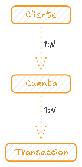

# Sistema de Gestión Bancaria

Implementar y simular un sistema bancario en memoria que permita administrar clientes, cuentas, transacciones y reportes financieros. Desarrollado en **Java 21** con el objetivo de aplicar los principales conceptos de java. programación orientado a objetos y buenas prácticas de desarrollo de software.
 
Este proyecto forma parte de mi portafolio personal y está enfocado en fortalecer mis habilidades en el desarrollo de software.

## Objetivos
- Aplicar Programación Orientada a Objetos.
- Practicar el uso de Collections.
- Utilizar Optional para búsquedas seguras.
- Implementar Exceptions personalizadas.
- Trabajar con Generics reutilizables.
- Resolver problemas utilizando Streams y Expresiones Lambda.
- Almacenar datos en memoria utilizando estructuras de datos adecuadas como collections.
- Mantener un flujo de trabajo profesional con Git y GitHub.

## Requisitos
- Java 21
- Maven
- Git
- Github

## Modelo ER

las relaciones entre las entidades son las siguientes:
- Un cliente puede tener múltiples cuentas.
- Una cuenta puede tener múltiples transacciones.
- La relación de uno a muchos es bidireccional.

## Modelo del dominio
### 1. Cliente:
Responsable de representar a un cliente del banco.
 
Funciones principales:
- Registrar cuentas
- Consultar cuentas
- Obtener información del cliente
### 2. Cuenta
Representa una cuenta bancaria. 
Operaciones:

- Depositar dinero
- Retirar dinero
- Transferir entre cuentas
- Consultar saldo
- Consultar historial de transacciones
### 3. Transacción
Representa cualquier movimiento realizado sobre una cuenta. 
Tipos:
- Depósito
- Retiro
- Transferencia

### 4. Funcionalidades
- Registro de clientes
- Creación de cuentas bancarias
- Depósitos
- Retiros
- Transferencias
- Historial de transacciones
- Consulta de cuentas
- Consulta de clientes
- Búsquedas utilizando Optional

#### Autor
José Bobadilla

